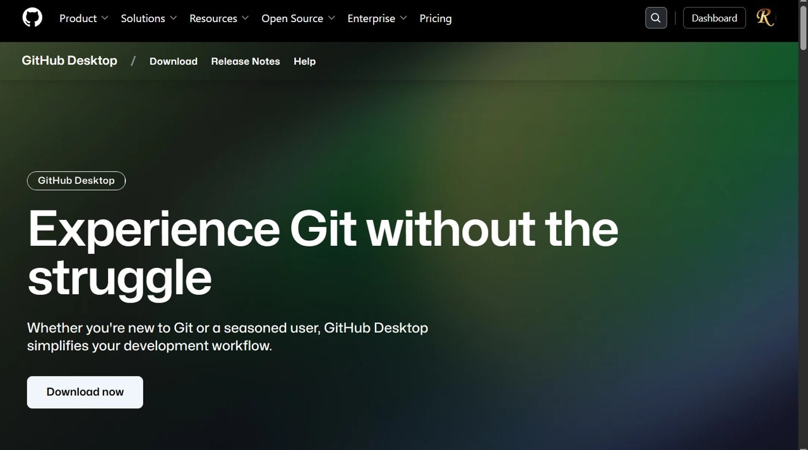
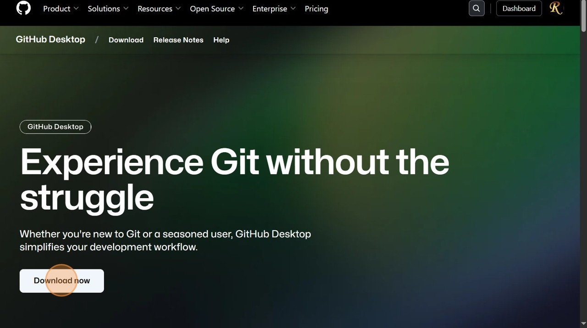
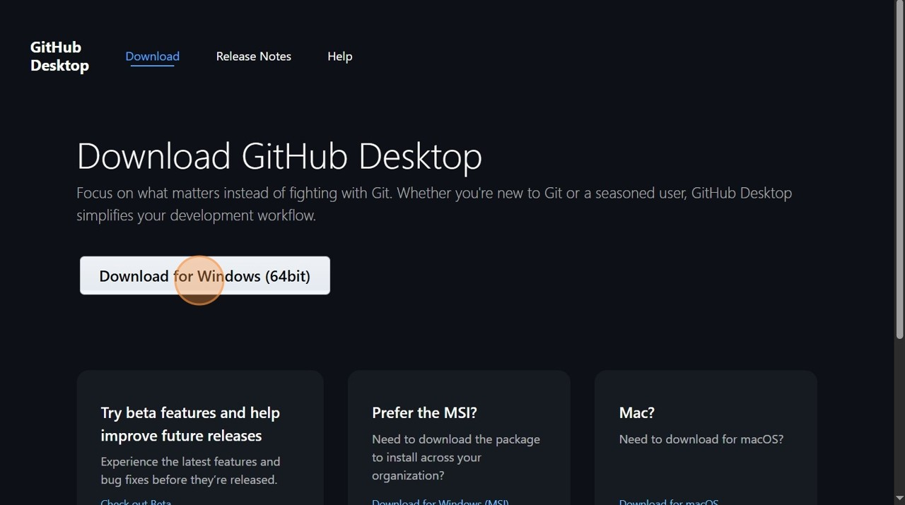
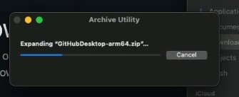
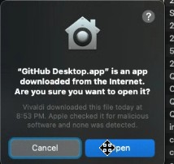
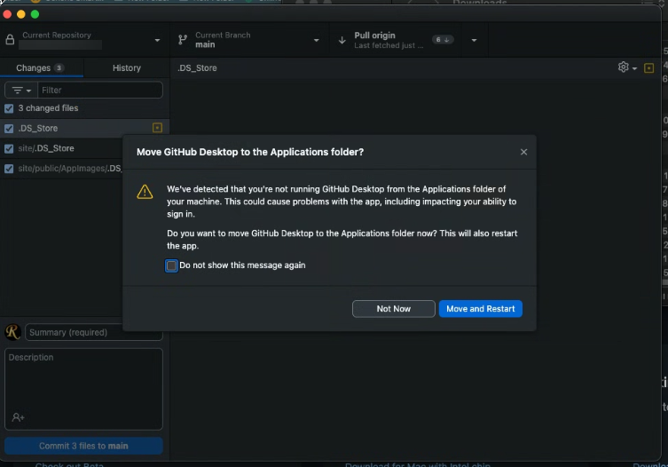
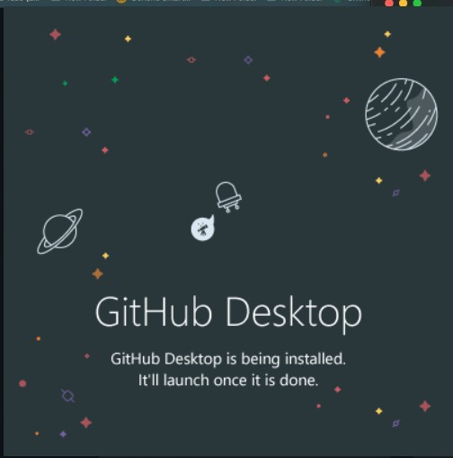
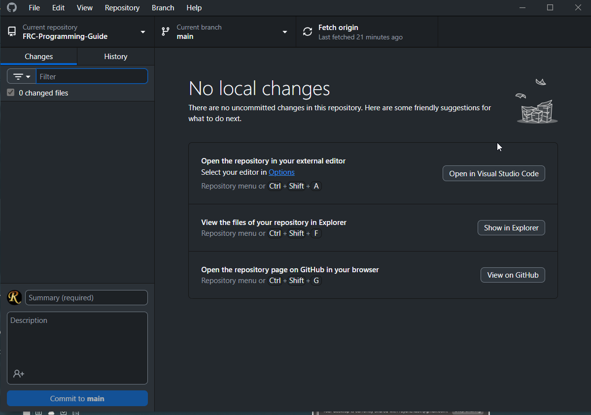

# **Installing GitHub Desktop**
## What is GitHub?
> Git is the de facto code version control system. It tracks changes to code as we are editing, allowing us more complicated ways of saving and managing our code. GitHub is a website that provides a fancy GUI (graphical user interface) to access the tools of Git without needing CLI (command line interface), and also allows our code to be stored in the cloud, so that one member's changes are visible to everyone. We can track everyone's contributions from their device, see where mistakes or bugs may have occurred, and revert as necessary. [read more on GIT and Github](https://montclairrobotics.github.io/FRC-Programming-Guide/Git/course/Usage.html#terminology) GitHub Desktop is an application used to interface between the two of them.

--- 
##  **Standard Installation**

> **GitHub does not support GitHub desktop for Linux, but there are alternatives or ported versions**

### Download
> 1. Navigate to  
> &emsp; **<a href="https://github.com/apps/desktop" target="_blank" rel="noopener noreferrer">https://github.com/apps/desktop</a>**
>
> &emsp;

> 2. Click "Download now"  
>
> &emsp; 

> 3. Click "Download for your device (Windows, Mac, etc.)"  
>
> &emsp;  

> 4. Proceed to the Installation process respective of your device.

---
## Install
### MacOS

> 5. Unzip GitHub zip file  
>
> &emsp;    
> &emsp;Accept any warnings.  
>
> &emsp;  

> 6. Run executable in downloads folder (and move to applications folder if necessary)  
>
> &emsp;  

> Voila! Installed.

> On either device, log in to your GitHub account. Await further instruction to receive invitation to our **<a href="https://github.com/MontclairRobotics/" target="_blank" rel="noopener noreferrer">organization</a>**. Then, add the repository to your device either through the GitHub Desktop app, or on the GitHub repository website. 

---

### Windows

> 5. Run executable (and give administrative rights if necessary). This is mostly an automated process. 
> 
> &emsp;  


> Voila! Installed. 
>
> &emsp;  

> On either device, log in to your GitHub account. Await further instruction to receive invitation to our **<a href="https://github.com/MontclairRobotics/" target="_blank" rel="noopener noreferrer">organization</a>**. Then, add the repository to your device either through the GitHub Desktop app, or on the GitHub repository website. 

<hr>

# **Installing GitKraken** (Alt)
To maintain consistency, use GitKraken only if GitHub GUI failed to install or you are on an unsupported device such as a Linux operating system.
## Windows & Mac
The process is as self explanatory as installing GitHub GUI, just using a different installation URL. Please use the *standard* GitHub GUI installation unless this is required as per your individual setup. 

>Go to [https://www.gitkraken.com/download](https://www.gitkraken.com/download) and select for your operating system, and run the installation proccess following the directions on screen. 

## Linux
Depending on your distro, download the according file, whether that be a `.rpm` / `.deb` / `.tar.gz`  (or use Snap Package Manager, depending on your support and prior installation of it). This proccess should be familiar to you if you are already familar with Linux.

**.deb File**
>Run (in the same directory as the downloaded file)
>```bash
>sudo dpkg -i gitkraken-amd64.deb
>sudo apt-get install -f  # f is to fix dependencies if needed
>```

**.rpm File**
>Install with (in same directory)
>`sudo rpm -i gitkraken-amd64.rpm`

**.tar.gz File**
>If you're here, you already know how to execute the steps necessary to properly use a `.tar.gz` archive; otherwise, it's more hassle than it's worth to get started as a beginner here.

Verify your gitkraken installation with
```gitkraken --version``` (& verify your `Git` too, this will come with `GitKraken`) ```git --version```

<hr>

# **Installing Git CLI** 
Real alphas don't need convenient things like applications. (Just kidding!) But seriously though, it is useful to know the commands and understand Git from the CLI perspective, but this setup could be a time waster long term, especially for a beginner. Any of the standard installation procedures will *automatically* install Git anyway. 

>Installing the GitHub GUI automatically installs Git, because Git is a dependency of GitHub. However, if you would like to install the CLI manually, below are the steps. 

## Windows:
>Launch Powershell (using the start menu or `Win`+`R`)

>Run
>```bash
>winget install --id Git.Git -e --source winget
>```

Breakdown of this Powershell line:
We are telling `winget`, the preinstalled package manager on windows, to search for Git from Microsoft offical records and to then install it (and to also verify that it is indeed the only Git in the Microsoft record)

>On either device, run `git --version` to verify successful installation of Git. 
To see the exact file location on Windows, type ```where git```, and on Mac & Linux, ```which git```

## MacOS:
Install HomeBrew first. 
It is a package manager essential to using MacOS CLI Commands. (Its technically possible to install Git without HomeBrew, but there's no reason to not have Brew installed anyway, its essential for every MacOS developer.)
>Open Spotlight, and search for `Terminal.app`

>Type this in. 
>```bash
>/bin/bash -c "$(curl -fsSL https://raw.githubusercontent.com/Homebrew/install/HEAD/install.sh)"
>```

Explanation of command:
`/bin/bash` tells the pre-existing shell to run the following, which is to `cURL`, `fetch` from the web, the `Homebrew` installation script, `install.sh`, over `ssl`, which is secure way to fetch files. The file can be verified to be authentic or not by navigating to the URL in the script and ensuring it isn't malicious.  

Homebrew may prompt you along the installation. Follow and accept. 

To confirm successful Brew installation, run 
>```bash
>brew --version
>```
Something should show on screen thats not an error. (homebrew will install to `/opt/homebrew`, but running `which brew` will show you specifically if the directory differs.)

Now, we can proceed to install Git. 
In the same terminal window, run
>```bash
>brew install git
>```
This tells `Brew` (not `bin\bash` like earlier) to install Git from its records. 

>On either device, run `git --version` to verify successful installation of Git. 
To see the exact file location on Windows, type ```where git```, and on Mac & Linux, ```which git```


## Linux:
>This can really depend on your distribution. If you already have gotten Linux, you will know how to determine your distribution. 

In your terminal, execute based on your distribution:

>Ubuntu / Debian-based: (most common)
>>```bash
>>sudo apt update
>>sudo apt install git
>>```

>Fedora:
>>```bash
>>sudo dnf install git
>>```

>Arch / Manjaro:
>>```bash
>>sudo pacman -S git
>>```

>openSUSE:
>>```bash
>>sudo zypper install git
>>```

>In each of these commands, all we are telling the computer to do is to act as the administrator with full rights, to reference the operating system's package manager (like `winget` or `brew`) to install `Git` from their records.

To check where Git is installed in Linux, run 
```bash
which git
```
<hr>

Verify installation (all devices):
```bash
git --version
```

> You can learn about all the Git commands [here](https://git-scm.com/)