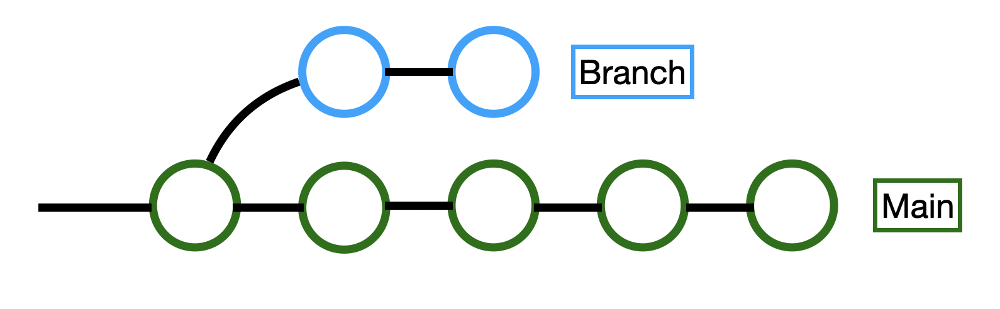

# **Git & GitHub Usage**

## Standard Workflow
> 'Workflow' in our definition is the chronological order we change code in before they are a part of the overall project. Reading the terminology below will help you understand what the workflow means.

- *Clone* or *fork* the *repository* (Once, in our case you will clone.) 
- Create a *branch* (If necessary)
- **Edit files locally**
- *Merge* (After pulling, If necessary)
- ***Stage* changes**
- ***Commit* changes** (With a description of what you changed)
- ***Push* to GitHub**
- Create a *Pull Request* (If necessary)
  - Have your code *reviewed* 
  - Have your code *merged* into the the main branch
- Repeat


## Terminology
Keep in mind the following when working with Git:

- **Repo/Codebase**: Short for *repository*; A repository is where the code of a project is stored, and can exist locally or remotely. 

- **Remote Repository**: A repository hosted on the web. Git can sync the repository across different devices and users. Our code is available on **GitHub** (https://github.com/MontclairRobotics), which is a *website that hosts Git repositories on the web*.

- **Commit**: A singular *saved version* of the repository. When a programer is ready they can *commit* the code so it is saved within git. A snapshot of the project that records the changes that were made since the last commit. It is a permanently saved record in the projects history. You can think of it as one saved version like in a google doc.

- **Stage**: Adding what file changes you want to include in your commit and what changes/files you want to leave out.

- **Push/Pull**: After a commit, you *push* your commits and other changes to the remote repository, and *pull* changes made to the remote onto your computer. Simply put, this syncs your local repository to the remote one. Pull gets changes from the remote repository and *merges* the changes in to your local repository. Pushing sends local changes to the remote repository. Make sure to pull before you commit and push so you can resolve any conflicts before they occur.

- **Clone**: Cloning is the process of putting a remote repository on a local device, and allows the Git on your computer to have a copy of the repository and all its history. This can now be edited directly on your computer, and this instance of the repository is referred to as a "**local**" repository.

- **Merge**: *The action of taking two versions of code and combining them into one.* For example, if changes have been made to the code since you started editing it, you will need to *merge* the code you wrote with the new version of the code. Simply put you need to merge two different versions of the same code into a singe version. If the changes each version made do not interfere with each other, then Git will usually be able to merge automatically. However if you need to merge to versions with changes that do interfere with each other, that is called a **merge conflict**. You will need to manually select which lines from each version will be combined into the final version. This can be done with two commits (often from different *branches*) or with a commit and uncommitted changes. The end result is a single version of the codebases that combines the two sets of changes.

- **Branch**: A branch is an independent line of development within a repository. You can take a commit and create a branch that comes out of it. There you can create changes and commits that are unaffected by the main branch. They allow developers to diverge from the main branch of work and make changes without affecting the main branch. Branches can also be merged back in. As a commit can be thought of as just a list of changes, these changes can be merged into the main branch again. Branches are useful for keeping things organized. You can have a branch that is focused on a specific thing. In this way the development of that thing does not interfere with the main branch. It is easy to switch branches, just change the "current branch" dropdown, and then fetch. (This will overwrite your device's local copy of the repository.) Below is a basic image of how the development of a project could look while using git branches.

&emsp;  &emsp; 

- **Pull Request**: A request for a branch to pull from your branch and merge your branches changes into itself. This is often, a request to modify the main branch of the repository with your modifications. Unlike a direct pull/push, a pull **request** allows for collaboration in independently-written code, in that someone else **must** read the code before it becomes part of the team's code. Another person can review your code and accept the pull request.

- **Code Review**: The process of a single team member's code being read by another. Similar to a peer review, this ensures that the code is being seen by more eyes. Two heads are better than one. 

- **Stash**: ```git stash``` tells Git to save your work in its current state temporarily. It turns your changes into a stash which is like a temporary and local commit that you can turn back into changes and continue working on. By saving using stash, the programmer can proceed to work on another project or another branch. ```git stash pop``` turns the stash back into changes in your working directory.

- **Origin**: Refers to the remote repository. 

- **Git States**: In Git, any file can be in any of four states. 
    
    Untracked - 
    >Git does not care if this file is modified, or deleted. This state is sometimes assigned to new files that are not created in tracked directories. 

    Modified - 
    > The file differs from the last origin fetch, but the file is not staged. 

    >A modified file is marked in VSCode (and the GitHub GUI) with 
    <br>
    >><span style="color:goldenrod"><strong>Yellow</strong></span> for an existing file that was changed,  
    >><span style="color:green"><strong>Green</strong></span> for no existing file, was an added file,  
    >><span style="color:red"><strong>Red</strong></span> for an existing file that was deleted.

    Staged - 
    >Planned to be uploaded to Git
        >>In GitHub GUI, this is the checkbox to the left of the file. 
    
    Committed -
    >Saved to Git/GitHub history ```git status``` executed in the CLI will show files to the terminal in their state.  (No local changes beyond the last commit.)

- **HEAD**: Head is where the user is at the current moment. Head moves as you move between branches. Head by default points to the latest commit of the branch you are on.

- **Checkout**: Change the working directory (the local files) to a different commit or branch. As commits are permanently saved versions of the code, you can check any of them out any time. If you have uncommitted changes you will need to *stash* or commit them first.

- **Detached HEAD**: A HEAD that points to a commit and not a branch. Git History is checking your code to that commit in the past, and not a current live branch.

- **GitHub Issues**: Allows us to plan our progress, by planning, prioritizing, and designating different incomplete tasks to different programmers. We can use this to communicate to collaborators where we are in the project's timeline, and link code to a discussion space easily. This for really organized people so I'm not sure how useful it is to us when we can communicate using basecamp but it is good to know.

- **GitHub Actions**: *This won't be nessasary for working on the robot*. Custom scripts that run automatically after an event such as pushes, pull requests, issue creation, or even on a schedule. These can be used for testing, building, deploying, or any automated task. A sample action, located in the ```.github/workflows``` as a YAML file
    ```YAML
    name: Run Tests

    on: [push]

    jobs:
    test:
        runs-on: ubuntu-latest

        steps:
        - uses: actions/checkout@v3
        - name: Run tests
            run: |
            npm install
            npm test
    ```
    This sample action runs after every push to the repository. It occurs on an ubuntu cloud computer, allocated to us for limited usage. It takes the steps of running npm install, and then it runs a sample test. In this way, if the automated action fails, then this push would be rejected. While this is a simple sample, GitHub actions can be so much more powerful. 

- **Fork**: You will not need to use this feature. Similar to cloning a repository, but the history of committed changes is no longer associated to the original repository. You are duplicating the repository for yourself to be independent of the original repository. Your changes are not synced to *their* cloud repository, and their changes will not be shown to your repository. A fork is duplicating or backing up a repository at a given moment, and the two repositories can differ and are not associated after the split. 
